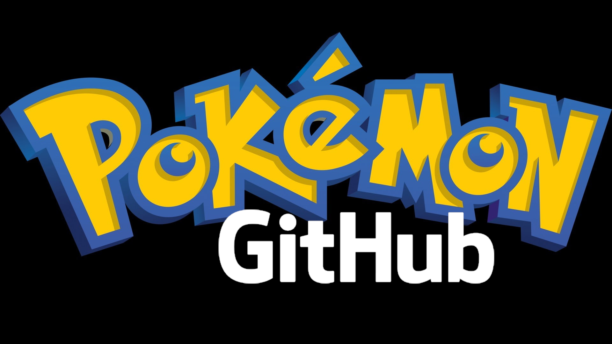

# Pokemon via GitHub contre Covid 2020 fr

> *"Jouons ensemble à tous les jeux Pokémon, via GitHub, pour nous occuper (et apprendre git et GitHub) durant la pandémie de Covid en 2020"*.

[Sur ce dépôt git](https://github.com/Pokemon-via-GitHub-contre-Covid-2020-fr/Pokemon-via-GitHub-contre-Covid-2020-fr.github.io), [je](https://naereen.github.io/me/) vais créer [ce site web](https://Pokemon-via-GitHub-contre-Covid-2020-fr.github.io/), pour faire la promotion de [ce projet "Pokemon-via-GitHub-contre-Covid-2020-fr"](https://github.com/Pokemon-via-GitHub-contre-Covid-2020-fr/).

> Auteur : [Lilian Besson (@Naereen)](https://github.com/Naereen/), inspiré librement par [Twitch plays Pokémon](https://fr.wikipedia.org/wiki/Twitch_Plays_Pok%C3%A9mon).

---

# Foire aux questions

## C'est quoi ce projet bizarre ?
> *Ecoute, je m'ennuie, je suis en confinement, je suis geek, j'ai des idées, j'ai pas de problème, alors pose pas de question pénible, veux-tu ?*

- Si tu es ici, c'est que tu es intéressé-e, chouette !
- Bienvenue dans le monde des Pokémon, devenus hyper geek en 2020 et boostés aux OGM que sont les nouvelles technologies comme celles sur [GitHub](https://GitHub.com).
- Dans ce projet, tu vas jouer avec d'autres de mes ami-e-s à des jeux Pokémon (d'abord *Bleu* ou *Rouge*) sur ton ordinateur, gratuitement, en utilisant un émulateur et une copie numérique du jeu de 1998 (une "rom").
  > Au lieu d'utiliser une vieille console trouvée dans le grenier, tu pourras installer [un émulateur](tutoriel_emulateur.md) (comme Visual Boy Advance, liens à venir), télécharger la rom du jeu Pokémon actuellement joué, [installer git](https://guides.github.com/activities/hello-world/) sur ton ordinateur, et télécharger la version actuelle du fichier de sauvegarde du jeu en cours.

- Nous allons joueur tous ensemble, chacun notre tour, sans anarchie, le plus vite, le plus élégament possible. Ca va être super marrant !
- Nous allons utiliser des technologies modernes, utilisées par des millions de développeurs de par le monde, pour synchroniser et échanger le fichier de sauvegarde.
  > Au lieu d'utiliser des mails, ou un "dossier partagé" comme avec Dropbox ou Google Drive, tu vas apprendre avec nous à utiliser `git` pour gérer les versions d'un fichier, pour collaborer à plusieurs sur un projet à l'ère du numérique.

## Comment lancer une partie sur un nouveau jeu ?

1. Avoir un consensus disant que le jeu numéro `n` est bien terminé, avant de commencer le jeu `n+1` !
   > Actuellement, le 15 avril 2020, `n=0` va nous laisser commencer sur le premier jeu `n=1`.

2. Avoir un consensus décidant le jeu à commencer, en respectant l'ordre (évidemment, on ne passe à un jeu de la génération `G` que lorsqu'un jeu ed la génération `G-1` a été terminé). act ;
   > Actuellement, le 15 avril 2020, `G=0` va nous laisser commencer sur la version *Rouge* ou *Bleu* ou *Jaune*.

3. [Me laisser](https://besson.link/) le plaisir de commencer la partie, et la douleur d'installer [un nouveau dépôt sur GitHub](https://github.com/organizations/Pokemon-via-GitHub-contre-Covid-2020-fr/repositories/new) pour le nouveau jeu ;

4. Vérifier que tout marche, que tous les joueurs et toutes les joueuses voulant participer ont mis une étoile sur le nouveau projet, l'ont cloné, ont pu jouer et sauvegarder le fichier ;

5. Se lancer : une joueuse décide de prendre la main, et ensuite s'enchaîne l'algorithme suivant :

   a. Au début, dans un état dans lequel aucun joueur n'a décidé d'être en train de jouer ;
   b. Joueur A décide de jouer, écrit un commit disant `"START blabla bla bla ?"` (via `git commit -m "START blabla bla"`);
   c. Joueur A décide de finir son moment de jouer :
      + faire deux captures d'écran, avec le menu ouvert (pour montrer l'équipe actuelle) et fermé (pour montrer le lieu actuel) ;
      + faire une sauvegarde ;
      + ajouter tout ça au dépôt (avec `git add save.gb XXX.png XXX_team.png`) ;
      + puis faire un commit expliquant ce qui a été fait durant la session de jeu (via `git commit -m "END"`);
      + et enfin synchroniser avec la version maître sur GitHub (avec `git push`) !
      + Attention : maximum 1 heure de temps réel (heure de Paris) entre un commit `"START"` et un commit `"END"`.
   d. Sans anarchie, sans problème, retour dans l'état initial a.
   e. Si problème, le maître de la ligue chef spirituel gère les conflits, à grand *coup d'boule* !

## Comment serons prises les décisions ? (cf. consensus)

Comme tout groupe de plus de un individu, assez vite, nous allons devoir prendre des décisions ensemble.

1. Si la décision est vraiment pas important, la joueuse actuelle décide seul-e (comme tout le reste),

2. Si la décision est trop assez important, par sondage, via un nouveau ticket sur le projet correspondant, et des votes :+1: et :-1: à répondre sous 24 heures,

3. Si la décision est trop important, le ou la maître de la ligue Pokémon du jeu `n-1` (actuellement, [@Naereen](https://GitHub.com/Naereen) déciderai seul, comme tout chef spirituel digne de ce nom !

4. Si la décision concerne la gestion technique du projet, [je (Lilian Besson, @Naereen)](https://GitHub.com/Naereen) conserve le pouvoir.
   > Et ouais, fallait avoir l'idée en premier ! *Remonte ton slibard, Lothard !*

## Mais en fait, pourquoi ?

1. Pour s'amuser, parce que vive les Pokémon ;
2. Pour s'amuser, parce que vive `git` et les nouvelles technologies ;
3. Pour rajouter du lien social avec certain-e-s ami-e-s, parce que fuck le confinement et le coronavirus etc ;
4. Pour s'initier de façon ludique à `git` ;
5. Par curiosité, pour être capable de répondre tout le reste de ma vie à la question très importante que voici : "combien faut-il de jeune geek en confinement pour finir ensemble Pokémon GGG en collaborant via GitHub" (GGG = version que l'on réussira à terminer) ;
6. Pour faire des jolies vidéos à la fin de chaque partie, résumant la partie et montrant qui jouait à quel moment.

## Je comprends rien à l'historique de commits, *qui est qui ?*

Regardez [le fichier](whois.md), qui fait le lien entre noms d'utilisateurs sur GitHub (e.g., [Naereen](https://GitHub.com/Naereen) pour moi), et noms des gens "en vrai".

---

## TODO

- [x] [Créer tutoriel émulateur](tutoriel_emulateur.md) :
- [x] Ajouter ici le lien vers le fichier [whois](whois.md) ;

- [ ] [Créer tutoriel `git` basique](tutoriel_git.md) ;
- [ ] Créer modèle de template sur ce dépôt ;
- [ ] Créer premier dépôt pour Pokémon version Rouge ou Bleu ou Jaune (Game Boy) :
  + [ ] Créer modèle de template sur ce dépôt ;

---

## :scroll: License ? 
MIT Licensed (file [LICENSE](LICENSE)).
© [Lilian Besson](https://GitHub.com/Naereen), 2020.

